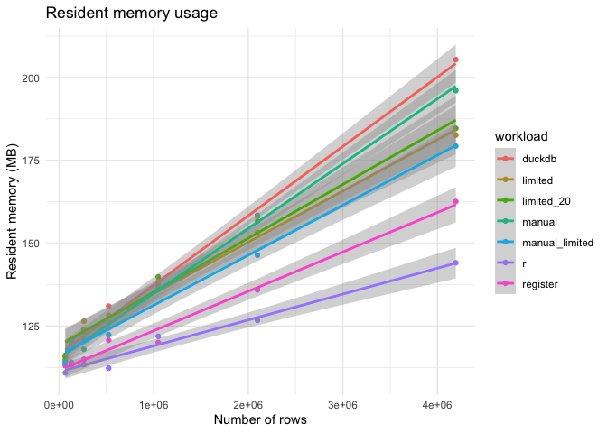
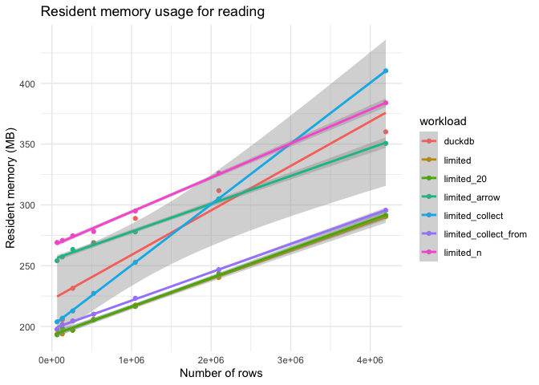

<!-- README.md is generated from README.Rmd. Please edit that file -->

# duckdb-mem

<!-- badges: start -->
<!-- badges: end -->

The goal of duckdb-mem is to analyze the memory usage of DuckDB.

## `dbWriteTable()`

Running variants of the code in `setup.R`, by `run_setup.R`:

- duckdb: Baseline
- r: Without `dbWriteTable()`
- limited: With a duckdb memory limit of 10 MB
- limited_20: With a duckdb memory limit of 20 MB
- register: With `duckdb_register()` instead of `dbWriteTable()`
- manual: With `duckdb_register()` and `CREATE TABLE` instead of
  `dbWriteTable()`
- manual_limited: With `duckdb_register()`, `CREATE TABLE`, and a duckdb
  memory limit of 10 MB

<!-- -->

### Linear model

    #> 
    #> Call:
    #> lm(formula = mem ~ workload, data = resident_size)
    #> 
    #> Coefficients:
    #>            (Intercept)         workloadlimited      workloadlimited_20  
    #>                141.308                  -3.578                  -2.989  
    #>         workloadmanual  workloadmanual_limited               workloadr  
    #>                 -2.750                  -7.194                 -20.835  
    #>       workloadregister  
    #>                -15.502

### Overhead

    #> # A tibble: 7 × 5
    #>   workload       mem_min mem_max mem_delta overhead
    #>   <chr>            <dbl>   <dbl>     <dbl>    <dbl>
    #> 1 r                 111.    144.      33.2     1   
    #> 2 register          113.    163.      49.5     1.49
    #> 3 manual_limited    114.    179.      65.5     1.97
    #> 4 limited           115.    183.      67.5     2.03
    #> 5 limited_20        116.    185.      68.5     2.06
    #> 6 manual            114.    196.      81.6     2.46
    #> 7 duckdb            116.    205.      89.6     2.70

### Conclusion

- Registering the data frame consumes a bit of memory, but not that
  much.
- The `setup-manual.R` script is equivalent to `setup.R` in terms of
  memory usage, but uses functions at a lower level compared to
  `dbWriteTable()`.
- The `CREATE TABLE` statement in `setup-manual.R` seems to be
  responsible for the memory overhead.
- Despite the limit of 10MB DuckDB memory in `setup-manual-limited.R`,
  the memory overhead is over 25MB.

## `dbGetQuery()`

Running variants of the code in `read`.R`, by`run_read.R\`:

- duckdb: Baseline, `dbGetQuery()`
- limited: With a duckdb memory limit of 10 MB
- limited_20: With a duckdb memory limit of 20 MB
- limited_collect: With a duckdb memory limit of 10 MB, using
  `collect(n = n)`
- limited_collect_from: With a duckdb memory limit of 10 MB, using
  `tbl(con, "FROM data LIMIT ...") |> collect()`
- limited: With a duckdb memory limit of 10 MB, using
  `dbGetQuery(n = n)`

<!-- -->

### Linear model

    #> 
    #> Call:
    #> lm(formula = mem ~ workload, data = resident_size)
    #> 
    #> Coefficients:
    #>                  (Intercept)               workloadlimited  
    #>                      265.777                       -45.442  
    #>           workloadlimited_20         workloadlimited_arrow  
    #>                      -44.973                        16.487  
    #>      workloadlimited_collect  workloadlimited_collect_from  
    #>                       -5.962                       -40.098  
    #>            workloadlimited_n  
    #>                       33.882

### Overhead

    #> # A tibble: 7 × 5
    #>   workload             mem_min mem_max mem_delta overhead
    #>   <chr>                  <dbl>   <dbl>     <dbl>    <dbl>
    #> 1 limited                 197.    290.      92.9     1   
    #> 2 limited_arrow           254.    351.      96.5     1.04
    #> 3 limited_collect_from    198.    296.      97.7     1.05
    #> 4 limited_20              193.    292.      98.4     1.06
    #> 5 limited_n               269.    384.     115.      1.24
    #> 6 duckdb                  194.    360.     166.      1.79
    #> 7 limited_collect         204.    410.     206.      2.22

### Conclusion

- The size of the data is about 48 MB, so the memory overhead is about
  twofold.
- `collect(n = n)` is poison, with far worse overhead, only surpassed by
  `dbGetQuery(n = n)` (which is very surprising).
- `tbl(con, "FROM data LIMIT ...") |> collect()` is the best option for
  a lazy table.
- Action items:
  - Understand double memory usage in `dbGetQuery()`
  - Understand `dbGetQuery(n = n)`
  - See if ALTREP or a different way of fetching partial results (e.g.,
    in the C++ glue) can help
